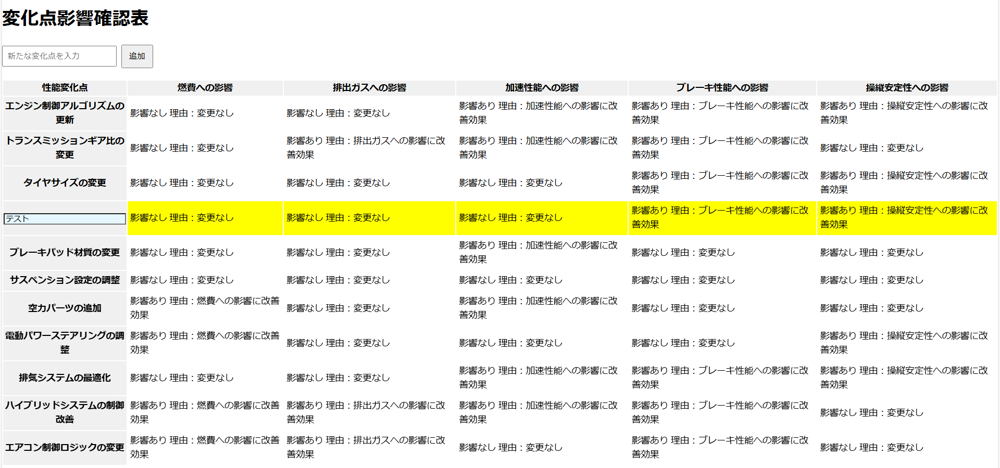

# ローカルでの起動方法

アプリ作成と起動の確認
```bash
cd dynamic-table
npm install
npm start
```

# 前提

- データの持ち方は考えていない。
- あくまで画面のイメージのみ。



- 変化点を追加入力すると、ランダムな行が追加される。（本来は推論して類似度が近い行）
- 追加した行は黄色くなる。
- 追加した行のみ編集できる。※本来は入力させたい項目を明示的にしたいので、ポップアップ入力画面にしたい